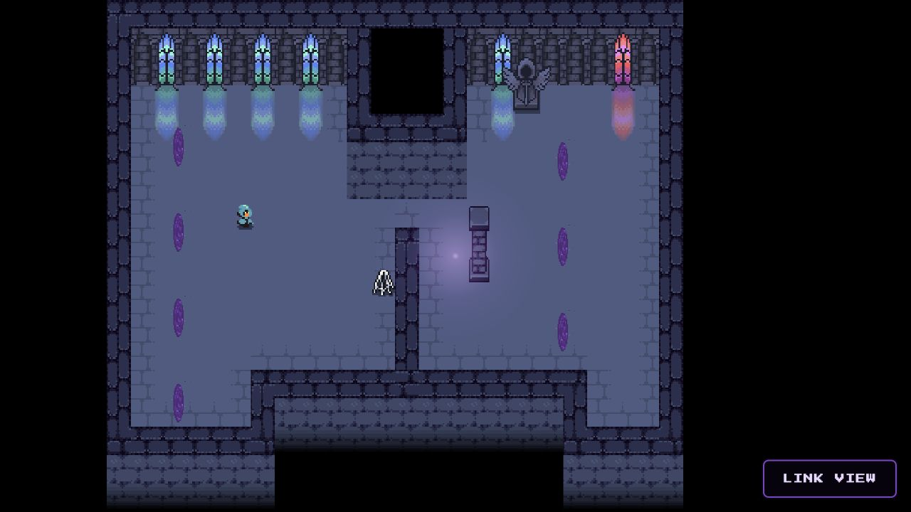
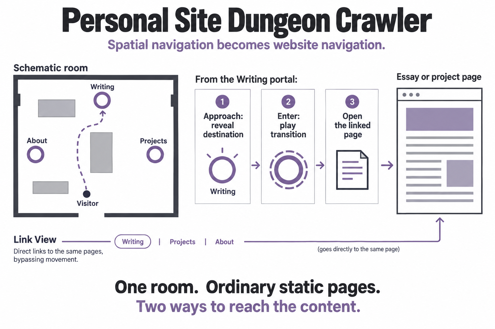

(AI-assisted writeup)

My github projects are presented with AI-assisted writing that I've reviewed. If you would like to check out my fully-human thoughts on my projects, please see my personal website [cassie.mccoy.world](https://cassie.mccoy.world)

# Personal Site Dungeon Crawler

**A playable front door to my writing and projects.**

I built a small dungeon crawler as my personal site's navigation. Visitors explore a pixel-art room, weave around its walls and props, cast fireballs, and enter animated portals that lead to essays and project links. A conventional **Link View** offers a direct route to the writing without navigating the room.

**[Play the dungeon crawler](https://c4554ndr4.github.io/portfolio/)** · [My personal website](https://cassie.mccoy.world) · [Explore the game implementation](src/game/main.ts)

## Explore the room

The room is a compact, one-room exploration experience. Portals turn spatial navigation into website navigation: approaching one reveals its destination, and entering it plays a transition before opening the linked page. The fireballs and animated scenery make the room feel like a place to play while browsing.

| Action | Desktop | Touch / pointer |
|---|---|---|
| Move | Arrow keys or WASD | Drag in the game area |
| Cast a fireball | Space | Tap in the game area |
| Open a destination | Walk into a portal | Tap or enter a portal |
| Browse links directly | Select **Link View** | Select **Link View** |

## How it works

The architecture separates the room, the game behavior, and the content it points to. A map describes tiles, obstacles, decoration, and portal locations. The game handles movement, collisions, projectiles, animations, and nearby-portal feedback. Portal destinations connect those interactions to normal website pages.

*Conceptual navigation map; the screenshot above shows the actual room.*

The site pages and game bundle are built together for a static deployment. There is no application server required for the dungeon itself. The game can be rebuilt after a navigation change, while essays remain independently readable pages.

For a code review, start with the [scene and interaction loop](src/game/main.ts), [portal configuration](src/game/portals.ts), and [site entry point](src/pages/index.astro). The [development guide](DEVELOPMENT.md) covers local setup, map editing, content, and deployment.

## Art credits

The game and website integration use third-party pixel-art assets, including [MiniRogue Dungeon by matheus tanuri](https://matheustanuri.itch.io/minirogue-dungeon), [portal sprites by Elthen](https://elthen.itch.io/2d-pixel-art-portal-sprites), and the Cute Fantasy Dungeons pack. See the [site credits](src/pages/credits.astro) and the [Cute Fantasy asset license](Cute_Fantasy_Dungeons/read_me.txt). Asset packs retain their creators' licenses; the repository is not a blanket grant to reuse or redistribute them.
